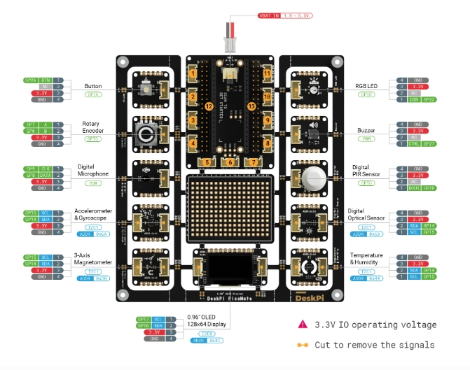

# Picomate

* The [Picomate board][] is produced by [Deskpi][]. The
DeskPi PicoMate [Wiki User Manual][] provides a complete description
of the [Picomate board][]
* Create environment for pico called `pico`

## Installation

**_Make sure that a data usb cable is used when connecting the Pico to
the PC. A lot of cables are just charging usb cables._**

* Follow instructions in [Pico getting started][]
* `picomate`is main directory for `pico W`
* [Deskpi Pico Libraries][] must be downloaded and copied to `lib`
on `CIRCUITPY` and in `picomate/libs`.
* [CircuitPython standard libraries][] are not the same as the
above.

## TODO investigate above

Circuitpython loaded

* Adafruit CircuitPython 8.2.9 on 2023-12-06; Raspberry Pi Pico W
with rp2040
* Board ID:raspberry_pi_pico_w
* UID:E6616408432F8E32
* MAC:28:CD:C1:09:0D:E2

## Circuit Python

[CircuitPython][] is a programming language designed to simplify
experimenting and learning to code on low-cost microcontroller boards.

A [CircuitPython introduction][] is available at [Adafruit Learn][]

Version of [CircuitPython][] executing

`Adafruit CircuitPython 8.2.9 on 2023-12-06; Raspberry Pi Pico W with rp2040`

### Core Modules

The [CircuitPython core modules][] are intended on being consistent across ports and boards. A module may not exist on a port/board if no underlying hardware support is present or if flash space is limited. For example, a microcontroller without analog features will not have `analogio`.

[CircuitPython 8.2 Documentation][] is the starting point fo [CircuitPython essentials][].

## Mu editor

 Mu Editor is a simple Python code editor for beginner programmers. Its very basic and can loaded from [Mu Editor download][]

### Pico W

The `UF.2` code base is to be found at [pico W uf2][]

## Blink RGB LED

----

[CircuitPython core modules]:https://docs.circuitpython.org/en/latest/shared-bindings/index.html#core-modules

[CircuitPython essentials]:https://learn.adafruit.com/circuitpython-essentials

[CircuitPython 8.2 Documentation]:https://docs.circuitpython.org/en/8.2.x/README.html

[CircuitPython standard libraries]:https://circuitpython.org/libraries

[CircuitPython introduction]:https://learn.adafruit.com/welcome-to-circuitpython

[Adafruit Learn]:https://learn.adafruit.com/

[Pico getting started]:https://wiki.deskpi.com/picomate/#getting-start

[Deskpi Pico Libraries]: https://wiki.deskpi.com/picomate/#libraries-download

[Mu Editor download]:https://codewith.mu/en/download

[CircuitPython]:https://circuitpython.org/

[pico W uf2]:https://circuitpython.org/board/raspberry_pi_pico_w/

[Wiki User Manual]:https://wiki.deskpi.com/picomate/

[Deskpi]:https://deskpi.com/

[Picomate board]:https://deskpi.com/collections/deskpi-picomate/products/new-deskpi-picomate-v1-0-with-raspberry-pi-pico-w-board
