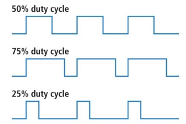

# Picomate

* The [Picomate board][] is produced by [Deskpi][]. The
DeskPi PicoMate [Wiki User Manual][] provides a complete description
of the [Picomate board][]
* Create environment for pico called `pico`

[seeed studio](https://www.seeedstudio.com/) provides [Grove devices][]
An [Introduction to Grove][] and how to use Grove connectors.

## Installation

**_Make sure that a data usb cable is used when connecting the Pico to
the PC. A lot of cables are just charging usb cables._**

* Follow instructions in [Pico getting started][]
* `picomate`is main directory for `pico W`
* [Deskpi Pico Libraries][] must be downloaded and copied to `lib`
on `CIRCUITPY` and in `picomate/libs`.
* [CircuitPython standard libraries][] are not the same as the
above.

## TODO investigate above

Circuitpython loaded

* Adafruit CircuitPython 8.2.9 on 2023-12-06; Raspberry Pi Pico W
with rp2040
* Board ID:raspberry_pi_pico_w
* UID:E6616408432F8E32
* MAC:28:CD:C1:09:0D:E2

## Grove

### Interface of Grove Pico modules

You may notice that there're 4 color of the Grove cable.

| Pin   | Colour of Grove cable                             |
|-------|---------------------------------------------------|
| pin 1 | Yellow (for example, SCL on I2C Grove Connectors) |
| pin 2 | White (for example, SDA on I2C Grove Connectors)  |
| pin 3 | Red - VCC on all Grove Connectors                 |
| pin 4 | Black - GND on all Grove Connectors               |

## Grove Pico Interface types

There're mainly 4 type of Interface of Grove modules.

### Grove Pico Digital

* A digital Grove connector consists of the standard four lines coming into the Grove plug.
* The two signal lines are generically called D0 and D1.
  * Most modules only use D0, but some do (like the LED Bar Grove display) use both.
* Often base units will have the first connector called D0 and the second called D1 and they will be wired D0/D1 and then D1/D2, etc.
* Examples of Grove Digital modules are:
  * Switch Modules,
  * Fan Module,
  * LED Module.

| Pin   | Function |              Note               |
|-------|:--------:|:-------------------------------:|
| pin 1 |    Dn    |  Primary Digital Input/Output   |
| pin 2 |   Dn+1   | Secondary Digital Input/Output  |
| pin 3 |   VCC    | Power for Grove Module, 5V/3.3V |
| pin 4 |   GND    |             Ground              |

### Grove Pico Analog

* An Grove Analog connector consists of the standard four lines coming into the Grove plug.
* The two signal lines are generically called A0 and A1.
  * Most modules only use A0. Often base units will have the first connector called A0 and the second called A1 and they will be wired A0/A1 and then A1/A2

| Pin   | Function |              Note               |
|-------|:--------:|:-------------------------------:|
| pin 1 |    An    |      Primary Analog Input       |
| pin 2 |   An+1   |     Secondary Analog Input      |
| pin 3 |   VCC    | Power for Grove Module, 5V/3.3V |
| pin 4 |   GND    |             Ground              |

### Grove Pico UART

* The Grove UART module is a specialized version of a Grove Digital Module.
* It uses both Pin 1 and Pin 2 for the serial input and transmit.
* The Grove UART plug is labeled from the base unit point of view.
  * Pin 1 is the RX line (which the base unit uses to receive data, so it is an input)
  * Pin 2 is the TX line (which the base unit uses to transmit data to the Grove module).

| Pin   | Function |              Note               |
|-------|:--------:|:-------------------------------:|
| pin 1 |    RX    |         Serial Receive          |
| pin 2 |    TX    |         Serial Transmit         |
| pin 3 |   VCC    | Power for Grove Module, 5V/3.3V |
| pin 4 |   GND    |             Ground              |

### Grove Pico I2C

* There are many types of I2C Grove sensors available.
* Most are 5V/3.3V devices
* The Grove I2C connector has the standard layout.
  * Pin 1 is the SCL signal and
  * Pin 2 is the SDA signal.
  * Power and Ground are the same as the other connectors.
* This is another special version of the Grove Digital Connector.
  * Often the I2C bus on a controller (like the ESP8266, Raspberry Pi
  and the Arduino) just uses Digital I/O pins to implement the I2C bus.
  * The pins on the Raspberry Pi and Arduino are special with
  hardware support for the I2C bus.

| Pin   | Function |              Note               |
|-------|:--------:|:-------------------------------:|
| pin 1 |   SCL    |            I2C Clock            |
| pin 2 |   SDA    |            I2C Data             |
| pin 3 |   VCC    | Power for Grove Module, 5V/3.3V |
| pin 4 |   GND    |             Ground              |

1. Analog Ports: include 3 analog ports, A0, A1, A2.
2. Digital Ports: include 3 digital ports, D16, D18, D20.
3. UART Port: 2 UART port.
4. I2C Ports: 2 I2C ports.
5. Power Switch: 5V/3.3V selectable power switch.
6. SPI port: 1 spi0 port.

Dimension: 56mm * 56mm

## Circuit Python

[CircuitPython][] is a programming language designed to simplify
experimenting and learning to code on low-cost microcontroller boards.

A [CircuitPython introduction][] is available at [Adafruit Learn][]

Version of [CircuitPython][] executing

`Adafruit CircuitPython 8.2.9 on 2023-12-06; Raspberry Pi Pico W with rp2040`

### Core Modules

The [CircuitPython core modules][] are intended on being consistent across ports and boards. A module may not exist on a port/board if no underlying hardware support is present or if flash space is limited. For example, a microcontroller without analog features will not have `analogio`.

[CircuitPython 8.2 Documentation][] is the starting point fo [CircuitPython essentials][].

## Mu editor

 Mu Editor is a simple Python code editor for beginner programmers. Its very basic and can loaded from [Mu Editor download][]

### Pico W

The `UF.2` code base is to be found at [pico W uf2][]

## Blink RGB LED

The make of the LED `WS2812 RGB LED`

## Rotary Encoder

DeskPi PicoMate has an incremental **[rotary encoder][]** pre-wired to the Pico,
which converts the motion of the switch (clockwise or counter clockwise)
into an output signal that can be used to determine what direction the
knob is being rotated.

A **[rotary encoder][]** is a device that measures the angular position
(rotation) of a shaft. It converts it into a signal that can be used to
find the position and direction of rotation. They are primarily used in
motors to provide better control and in user interfaces to replace
potentiometers.

|         Rotary Encoder Pin          | On Pico |
|:-----------------------------------:|:-------:|
|                  A                  |   GP7   |
|                  B                  |   GP6   |
| Switch(Optional, Active High Level) |  GP26   |

## Buzzer

DeskPi PicoMate has a buzzer pre-wired to GP27 on the Pico. To control the buzzer from CircuitPython we will use its built in PWM, or pulse-width modulation, signal generation capabilities.

Buzzer uses **pulse width modulation** (PWM)

### Pulse Width Modulation (PWM)

* Widely used in various applications, including sophisticated control circuitry.
* Commonly employed for:
  * Dimming RGB LEDs.
  * Controlling servo direction.
* Achieves a range of outcomes by varying the high signal time analogously.
* Signal can only be high (usually 5V) or low (ground) at any moment.
* Proportion of high signal time can be adjusted consistently over a time interval.

### Duty Cycle

* Represents the proportion of time a digital signal is in the "on" state (high) over a specific interval.
* Measured in percentage.
* Describes how much time the signal spends in the "on" state relative to the entire period.
* The period is the inverse of the waveform frequency.

* Examples:
  * **50% Duty Cycle**: Signal spends equal time "on" and "off," resembling an ideal square wave.
  * **>50% Duty Cycle**: More time in the "on" state than the "off" state.
  * **<50% Duty Cycle**: More time in the "off" state than the "on" state.

----
[Introduction to Grove]:https://www.seeedstudio.com/document/pdf/Introduction%20to%20Grove.pdf

[Grove devices]:https://www.seeedstudio.com/catalogsearch/result/?q=grove

[rotary encoder]:https://en.wikipedia.org/wiki/Rotary_encoder

[CircuitPython core modules]:https://docs.circuitpython.org/en/latest/shared-bindings/index.html#core-modules

[CircuitPython essentials]:https://learn.adafruit.com/circuitpython-essentials

[CircuitPython 8.2 Documentation]:https://docs.circuitpython.org/en/8.2.x/README.html

[CircuitPython standard libraries]:https://circuitpython.org/libraries

[CircuitPython introduction]:https://learn.adafruit.com/welcome-to-circuitpython

[Adafruit Learn]:https://learn.adafruit.com/

[Pico getting started]:https://wiki.deskpi.com/picomate/#getting-start

[Deskpi Pico Libraries]: https://wiki.deskpi.com/picomate/#libraries-download

[Mu Editor download]:https://codewith.mu/en/download

[CircuitPython]:https://circuitpython.org/

[pico W uf2]:https://circuitpython.org/board/raspberry_pi_pico_w/

[Wiki User Manual]:https://wiki.deskpi.com/picomate/

[Deskpi]:https://deskpi.com/

[Picomate board]:https://deskpi.com/collections/deskpi-picomate/products/new-deskpi-picomate-v1-0-with-raspberry-pi-pico-w-board
